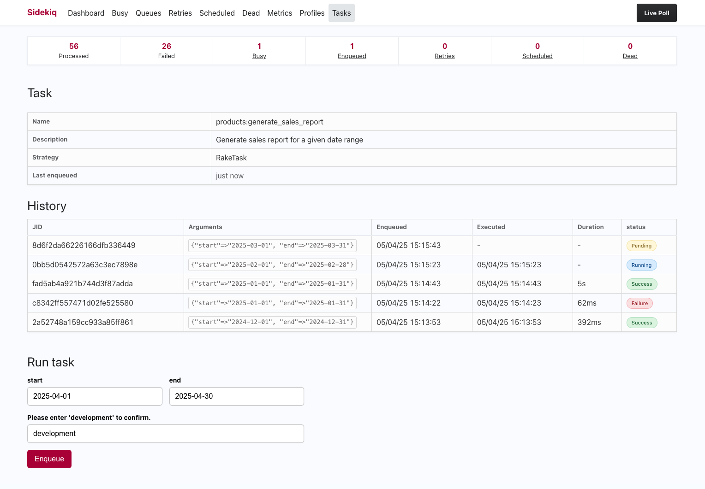

# Sidekiq::Tasks

[](https://github.com/victorauthiat/sidekiq-tasks/actions/workflows/ci.yml)
[](https://codeclimate.com/github/VictorAuthiat/sidekiq-tasks/maintainability)
[](https://codeclimate.com/github/VictorAuthiat/sidekiq-tasks/test_coverage)

> A [Sidekiq](https://github.com/sidekiq/sidekiq) extension for task management.

Sidekiq-Tasks extends Sidekiq by providing an interface to enqueue tasks directly from the web interface. By default it works with Rake tasks but it can be easily extended to support other task execution systems.



## Installation

```bash
bundle add sidekiq-tasks
```

If bundler is not being used to manage dependencies, install the gem by executing:

```bash
gem install sidekiq-tasks
```

Add the following to your `config/routes.rb` file:

```ruby
require "sidekiq/web"
require "sidekiq/tasks/web"
```

Now you can access the web interface at `/sidekiq/tasks` and you'll see a list of all the available tasks.
Once you've found your task, you can access the task details page to see the metadata, history and form to enqueue the task.

## Prerequisites

Sidekiq Tasks is based on the concept of **strategies** and **rules** to manage **tasks**.

- A **task** represents a unit of work that can be enqueued and executed.
- A **strategy** defines how tasks are loaded, built, enqueued, and executed.
- A **rule** is a condition given to a strategy to determine which tasks are available.

By default, it comes with the `Sidekiq::Tasks::Strategies::RakeTask` strategy, which allows you to enqueue and execute Rake tasks with their arguments.

> [!NOTE]
> In accordance with the principle of least privilege, it has the following rules:
> - **`TaskFromLib`** Only tasks from the `lib` folder are loaded.
> - **`EnableWithComment`** Only tasks explicitly enabled with a magic comment are loaded.

Example of an enabled task in `lib/tasks/my_task.rake`:

```ruby
# sidekiq-tasks:enable
task :my_task do
  puts "my_task"
end
```

Enable all tasks within a namespace:

```ruby
# sidekiq-tasks:enable
namespace :my_namespace do
  task :my_task do
    puts "my_task"
  end

  task :another_task do
    puts "another_task"
  end
end
```

You can also use `DisableWithComment` rule to selectively **disable** tasks. (see [strategies configuration](#strategies-configuration))
It works similarly to `EnableWithComment`, but with inverted logic. Example of a disabled task:

```ruby
# sidekiq-tasks:disable
task :my_task do
  puts "my_task"
end
```

## Strategies configuration

Strategies can be configured through the `config.strategies` option.
For example if you want to enable all tasks in the lib folder and disable a few specific ones manually:

```ruby
Sidekiq::Tasks.configure do |config|
  config.strategies = [
    Sidekiq::Tasks::Strategies::RakeTask.new(
      rules: [
        Sidekiq::Tasks::Strategies::Rules::TaskFromLib.new,
        Sidekiq::Tasks::Strategies::Rules::DisableWithComment.new,
      ]
    )
  ]
end
```

You can also define your own strategy creating a subclass of `Sidekiq::Tasks::Strategies::Base`.

Each strategy must implement the following methods:

  - `load_tasks`: Returns all the raw tasks that should be filtered.
  - `build_task_metadata`: Build metadata for a task.
  - `execute_task`: Execute a task.

A strategy has a `tasks` method that filters the loaded tasks according to the rules and builds `Sidekiq::Tasks::Task` instances with `build_task_metadata` for each raw task.

**Example:**

Here is an example of a strategy that loads tasks from a YAML configuration file, builds metadata and executes them as system commands:

```ruby
class ScriptStrategy < Sidekiq::Tasks::Strategies::Base
  def load_tasks
    YAML.load_file("config/scripts.yml")
  end

  def build_task_metadata(task)
    Sidekiq::Tasks::TaskMetadata.new(
      name: task["name"],
      desc: task["desc"],
      args: task["args"],
      file: task["file"]
    )
  end

  def execute_task(name, args = {})
    system "ruby #{name} #{args.values.join(" ")}"
  end
end

Sidekiq::Tasks.configure do |config|
  config.strategies = [ScriptStrategy.new]
end
```

> [!CAUTION]
> This is an example, executing tasks via system exposes your application to command injection risks.
> Never execute user input directly without strict validation.

## Strategy rules

Strategies can use rules to determine which tasks should be loaded.
Rules must inherit from `Sidekiq::Tasks::Strategies::Rules::Base` and implement the `respected?` method.
Here is an example of a rule that filters only scripts that match 'foo' in their filename:

```ruby
class FileMatchesFoo < Sidekiq::Tasks::Strategies::Rules::Base
  def respected?(task)
    task["file"].match?(/foo/)
  end
end

Sidekiq::Tasks.configure do |config|
  config.strategies = [ScriptStrategy.new(rules: [FileMatchesFoo.new])]
end
```

## Strategy enqueuing

By default, strategies enqueue tasks using the `Sidekiq::Tasks::Job` class.
You can configure `sidekiq_options` as follows:

```ruby
Sidekiq::Tasks.configure do |config|
  # Default options are {queue: "default", retry: false}
  config.sidekiq_options = {queue: "low", retry: false}
end
```

You can also override the `enqueue_task` method to implement your own enqueuing logic for your strategy:

```ruby
class ScriptStrategy < Sidekiq::Tasks::Strategies::Base
  def enqueue_task(name, params = {})
    ScriptJob.perform_async(name, params)
  end
end
```

> [!WARNING]
> Ensure that `enqueue_task` returns the JID of the Sidekiq job that will execute the task.

## Development

After checking out the repo, run `bin/setup` to install dependencies. Then, run `rake spec` to run the tests. You can also run `bin/console` for an interactive prompt that will allow you to experiment.

To install this gem onto your local machine, run `bundle exec rake install`. To release a new version, update the version number in `version.rb`, and then run `bundle exec rake release`, which will create a git tag for the version, push git commits and the created tag, and push the `.gem` file to [rubygems.org](https://rubygems.org).

## Contributing

Bug reports and pull requests are welcome on GitHub at https://github.com/victorauthiat/sidekiq-tasks. This project is intended to be a safe, welcoming space for collaboration, and contributors are expected to adhere to the [code of conduct](https://github.com/victorauthiat/sidekiq-tasks/blob/master/CODE_OF_CONDUCT.md).

## License

The gem is available as open source under the terms of the [MIT License](https://opensource.org/licenses/MIT).

## Code of Conduct

Everyone interacting in the Sidekiq::Tasks project's codebases, issue trackers, chat rooms and mailing lists is expected to follow the [code of conduct](https://github.com/victorauthiat/sidekiq-tasks/blob/master/CODE_OF_CONDUCT.md).
